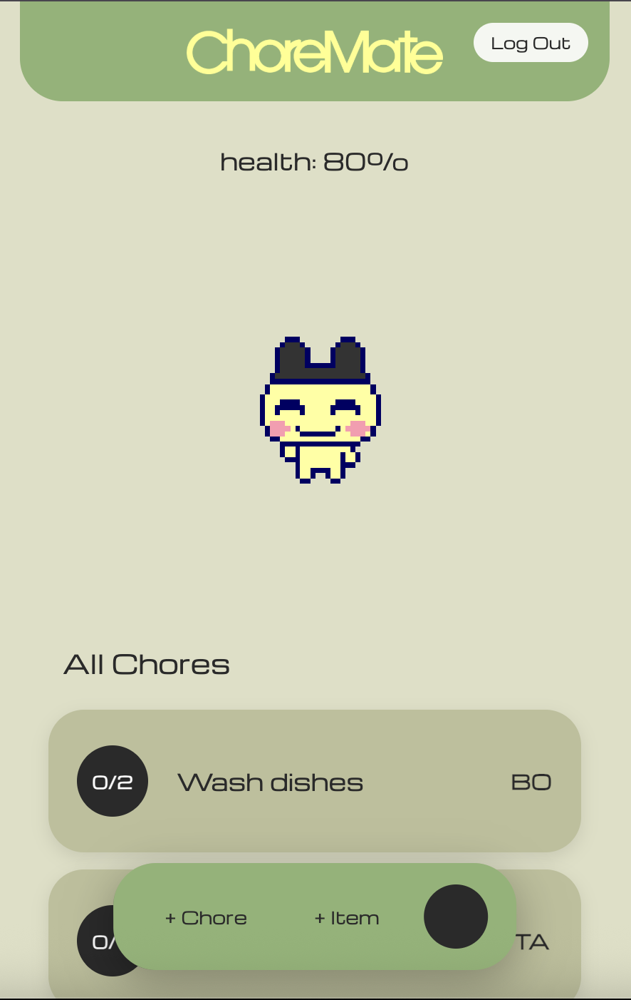

# ChorePet 

A gamified chore management app for roommates that motivates task completion through virtual pet care.

🌐 **Live Website**: [https://chore-pet-production.up.railway.app/](https://chore-pet-production.up.railway.app/)

## Overview

ChorePet transforms household chores into an engaging experience where completing tasks keeps a shared virtual pet healthy and happy. 

## Developer Roles
Frontend - Alina Scantlebury
Backend - Taiyo Williamson

## Features

### Pet Health System
- Pet health ranges from 0-100%
- Completing chores increases pet health (+10 per completed chore)
- Different pet animations based on health levels:
  - 90-100%: Happy animations
  - 80-89%: Normal state
  - 60-79%: Slightly concerned
  - 40-59%: Sad expressions
  - 20-39%: Very sad
  - 0-19%: Critical/dying state

### Smart Chore Management
- **Auto-Assignment**: Chores are automatically assigned based on user capacity and workload
- **Auto-Reassignment**: When chores are completed, they're automatically reassigned to different users
- **Capacity Balancing**: Users have capacity scores that prevent overloading
- **Difficulty & Frequency**: Chores have configurable difficulty (1-5) and frequency (1-7 times)
- **Time Limits**: 7-day deadlines for chore completion

## Usage

1. **Create User Account**: Sign up with a username to get started
2. **Login**: Use existing username to access your account
3. **Add Chores**: Create chores with frequency requirements (how many times to complete)
4. **Auto-Assignment**: Chores are automatically assigned to users based on capacity and workload balancing
5. **Complete Tasks**: Click on assigned chores to increment progress
6. **Monitor Pet Health**: Watch your pet's health improve as chores are completed

## A SneakPeek at the UI

